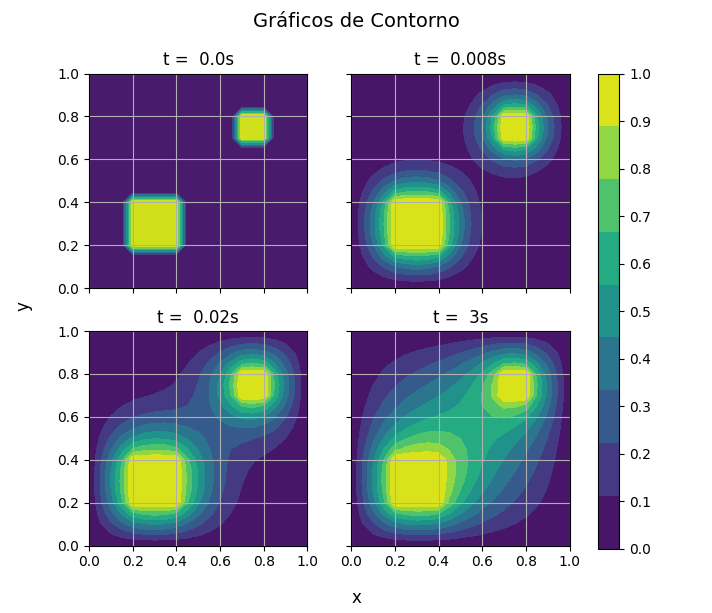

# Condução de Calor Bidimensional

Simulação computacional da condução de calor em uma placa com dois obstáculos de tamanhos diferentes.

## Setup
* Python 3.9
* Numpy
* Matplotlib

## Modo de uso
- Para Windows:
    ```bash
    python heat_conduction.py
    ```
- Para Linux:
    ```bash
    python3 heat_conduction.py
    ```

## Resultados da simulação
