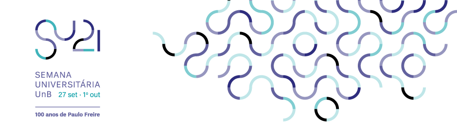

# Semana Universitária 2021 - UnB

<!--  -->

Este repostório contém os códigos apresentados no Curso de Python para Iniciantes do professor [Adriano Possebon Rosa] do Departamento de Engenharia Mecânica para [Semana Universitária 2021] da Universidade de Brasília.

[Adriano Possebon Rosa]: https://github.com/adrianopossebon
[Semana Universitária 2021]: http://dex.unb.br/semanauniversitariaunb
